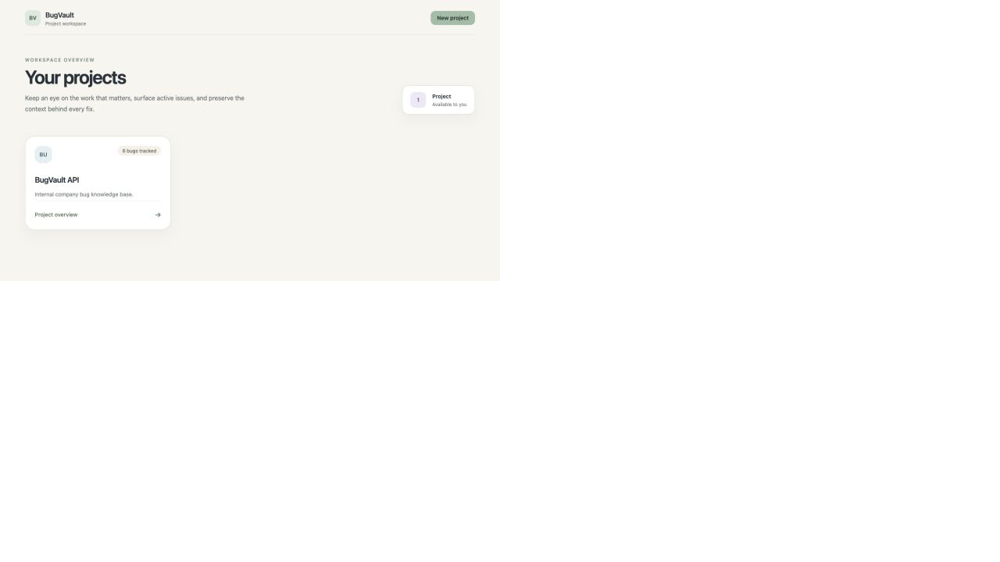
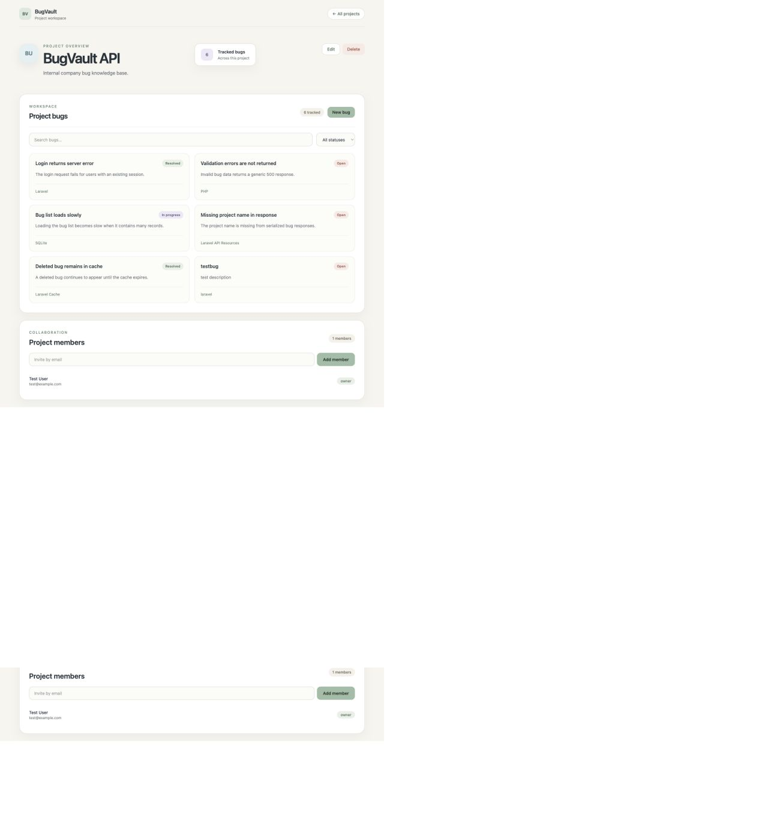
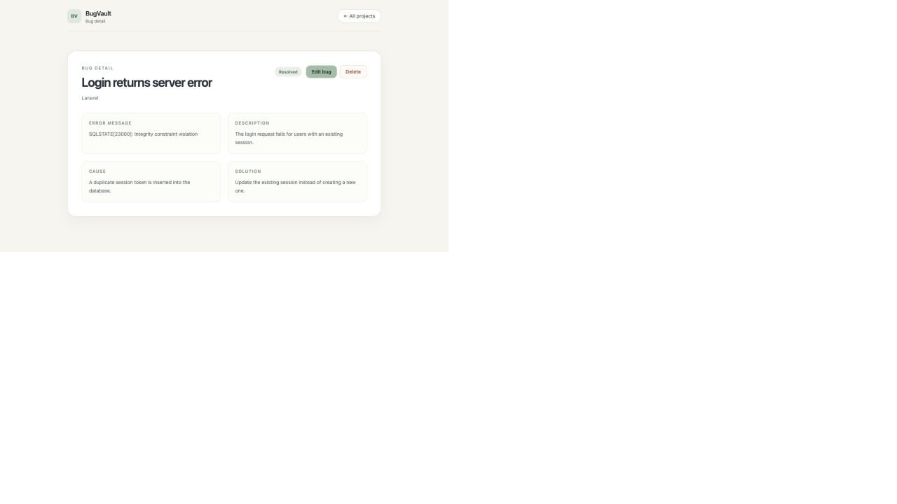

# BugVault

BugVault is a project-scoped bug knowledge base for engineering teams. It keeps bug reports, investigation context, fixes, and project collaboration in one place.

## Features

- Laravel Sanctum authentication.
- Dashboard for the user's projects.
- Project creation, editing, and owner-only deletion.
- Project-scoped bug creation, editing, searching, filtering, and deletion.
- Bug detail pages with investigation and resolution context.
- Many-to-many project membership with owner/member roles.
- Owner-only member management and authorization policies.
- JSON API resources and a responsive pastel React/Inertia interface.

## Screenshots

### Project dashboard



### Project workspace



### Bug detail



## Stack

- Laravel 13 and PHP 8.3+
- Laravel Sanctum
- Inertia.js 3
- React 19 and TypeScript
- Tailwind CSS 4
- SQLite for local development or MySQL in deployment

## Local setup

```bash
git clone https://github.com/Chris-wav/knowledge-codebase.git
cd knowledge-codebase
composer install
cp .env.example .env
php artisan key:generate
touch database/database.sqlite
php artisan migrate --seed
npm install
npm run build
php artisan serve
```

For frontend development, run `npm run dev` in a second terminal. The application is available at `http://127.0.0.1:8000`.

## Useful commands

```bash
php artisan test
npm run build
composer run dev
```

## Architecture

The backend uses resource controllers, form requests, API resources, Eloquent models, policies, and feature tests. The React frontend lives under `resources/js` and uses Inertia pages plus reusable form and card components.

```text
User ──< project_user >── Project ──< bug_project >── Bug
```

Users can only access projects they belong to. Owners can update projects and manage members; project members can work with bugs inside projects they can access.

## API overview

Authenticated endpoints are grouped under `/api`:

| Method | Endpoint | Purpose |
| --- | --- | --- |
| `POST` | `/api/login` | Sign in |
| `POST` | `/api/logout` | Sign out |
| `GET` | `/api/projects` | List the user's projects |
| `POST` | `/api/projects` | Create a project |
| `PATCH` | `/api/projects/{project}` | Update an owned project |
| `DELETE` | `/api/projects/{project}` | Delete an owned project |
| `GET` | `/api/projects/{project}/bugs` | List project bugs with search/filter support |
| `POST` | `/api/projects/{project}/bugs` | Create a bug |
| `PATCH` | `/api/projects/{project}/bugs/{bug}` | Update a bug |
| `DELETE` | `/api/projects/{project}/bugs/{bug}` | Delete a bug |
| `GET` | `/api/projects/{project}/members` | List project members |
| `POST` | `/api/projects/{project}/members` | Add a member by email |
| `DELETE` | `/api/projects/{project}/members/{user}` | Remove a member |

## Testing

Feature tests cover authentication, project visibility, membership authorization, bug access, and owner-only project actions. Run `php artisan test` and `npm run build` before opening a pull request.

## Status

BugVault is an actively developed MVP. The next focus is strengthening collaboration, expanding automated coverage, and preparing deployment.
